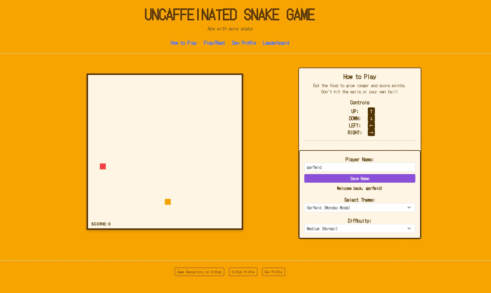

  
   <b>Hi! I'm A.J. Ramsden, a Senior at the University of North Alabama</b>
   I like to play games!

<h2 align="center">My Latest Project</h2>

<table align="center">
  <tr>
    <td width="400">
      <h3 align="center">🐍 Uncaffeinated - Solid Snake!</h3>
       
      
NEW VERSION!

      

        <a href="https://ajuna345.github.io/snake-app/"><strong>🎮 Play Game</strong></a>
        &nbsp;&nbsp;&nbsp;|&nbsp;&nbsp;&nbsp;
        <a href="https://github.com/AJuna345/snake-app"><strong>💻 Source Code</strong></a>
      

    </td>
  </tr>
</table>

### Socials

 <a href="https://www.github.com/AJuna345" target="_blank" rel="noreferrer"> <picture> <source media="(prefers-color-scheme: dark)" srcset="https://raw.githubusercontent.com/danielcranney/readme-generator/main/public/icons/socials/github-dark.svg" /> <source media="(prefers-color-scheme: light)" srcset="https://raw.githubusercontent.com/danielcranney/readme-generator/main/public/icons/socials/github.svg" />  </picture> </a>

